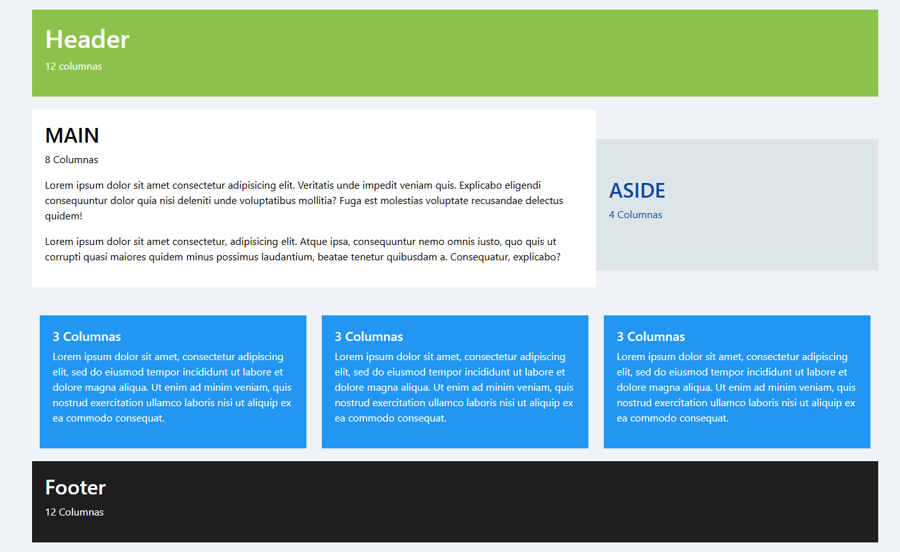

# Práctica 4 – Grid de Bootstrap 5

## 🧑‍🎓 Integrantes del grupo
- Pepe Salado  
- Pedro Pérez  
- Aihnoa Plata  

## 📌 Descripción del proyecto
Esta práctica consiste en la maquetación de una página web **totalmente responsiva** utilizando **Bootstrap 5**. El objetivo es aplicar el sistema de rejilla (grid system) para replicar una estructura específica compuesta por:

- **Header** (12 columnas)  
- **Main** (8 columnas) + **Aside** (4 columnas)  
- **Tres bloques de contenido** (cada uno de 4 columnas en tablet/escritorio, apilados en móvil)  
- **Footer** (12 columnas)

La página se adapta correctamente a **móviles, tabletas y pantallas de escritorio**, respetando la distribución de columnas según el tamaño del dispositivo.

## 🗂️ Estructura de carpetas
practica-bootstrap/
├── index.html # Página principal con la estructura HTML y grid de Bootstrap
├── css/
│ ├── bootstrap.min.css # Framework Bootstrap 5 (versión local)
│ └── estilos.css # Estilos personalizados con comentarios explicativos
└── js/
└── bootstrap.bundle.min.js # Scripts de Bootstrap (para funcionalidades interactivas)

> **Nota**: El proyecto utiliza Bootstrap localmente (archivos descargados), aunque también es válido usar CDN. En este caso, se optó por la versión local para cumplir con entornos sin conexión.

## 📱 Capturas de pantalla

### 🖥️ Escritorio (≥992px)

### 📱 Tablet (≥768px)

### 📲 Móvil (<768px)

## ✅ Características destacadas
- Uso correcto de `container`, `row` y clases `col-*` (`col-12`, `col-md-4`, `col-lg-8`, etc.)
- Comportamiento responsivo en los tres breakpoints principales (móvil, tablet, escritorio)
- Comentarios explicativos en HTML y CSS sobre la estructura y decisiones de diseño
- Código limpio, bien indentado y organizado
- Colores y espaciado coherentes con el diseño de referencia

## 🛠️ Tecnologías utilizadas
- HTML5
- CSS3
- Bootstrap 5 (v5.3+)